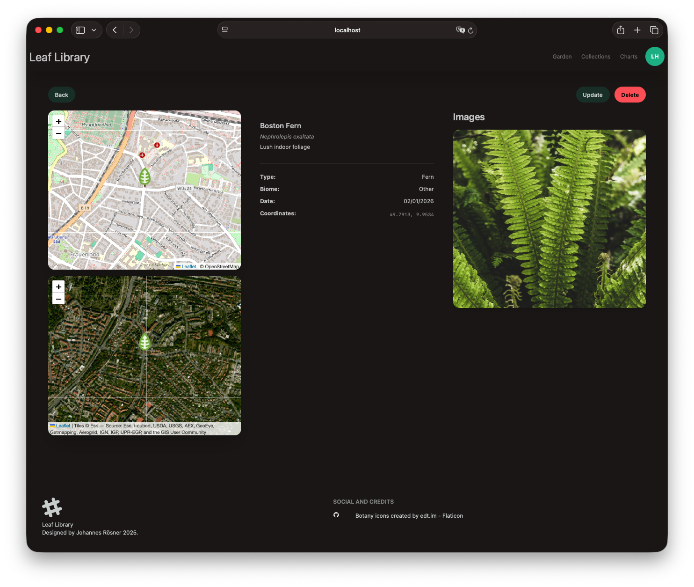
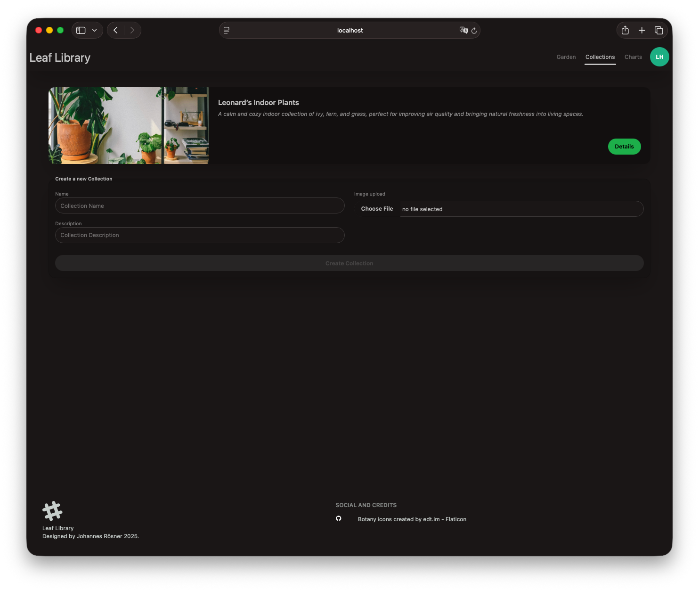
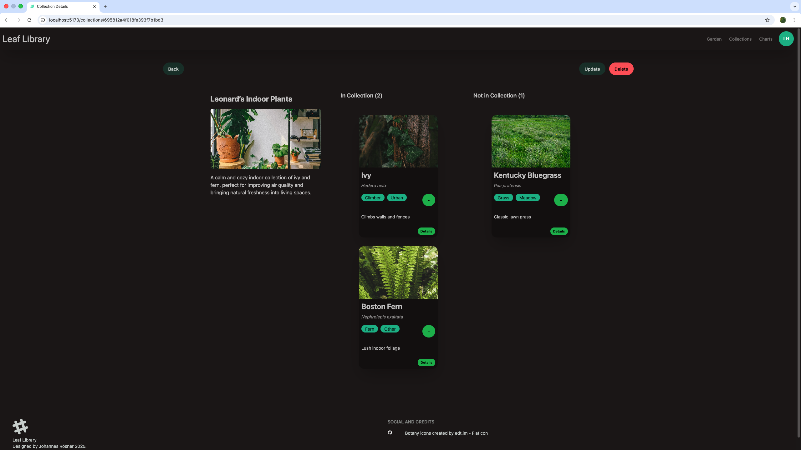
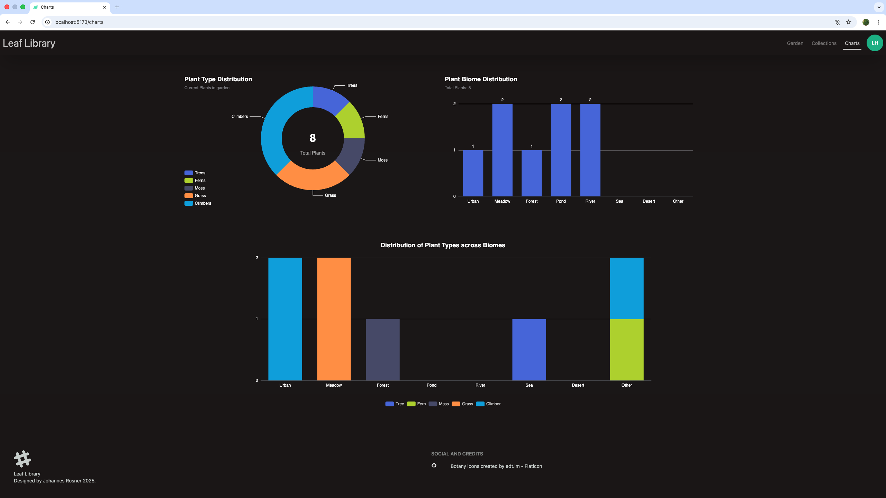

# Leaf Library - Frontend

A digital botanical garden built with _SvelteKit_ and _TypeScript_, consuming the [Hapi.js based backend API](https://github.com/johannesroesner/leaf-library-backend).

For information about the backend data model and system architecture, see the [backend README](https://github.com/johannesroesner/leaf-library-backend)

## Impressions

### Landing Page


### Garden View


### Plant Details



### Collections View



### Collections Details



### Charts View



## Features

- Browse and manage your personal garden of plants
- Create custom collections to organize plants
- Interactive map view for plant locations
- User authentication via JWT
- OAuth2 login support (GitHub)
- Charts to visualize your plant data via Apache ECharts
- Image upload support for plants, collections and user profiles
- SSR with SvelteKit for optimal performance

## Run Local

1. Clone the repository:
   ```bash
   git clone https://github.com/johannesroesner/leaf-library-frontend

   ```
2. Navigate to the directory:

   ```bash
   cd leaf-library-frontend

   ```

3. Create a `.env` file in the root directory based on the example file and adjust the environment variables as needed.

   ```text
   GITHUB_CLIENT_ID=dummy

   ```

4. Install dependencies::

   ```bash
   npm install

   ```

5. Start the application:
   ```bash
   npm run dev
   ```
